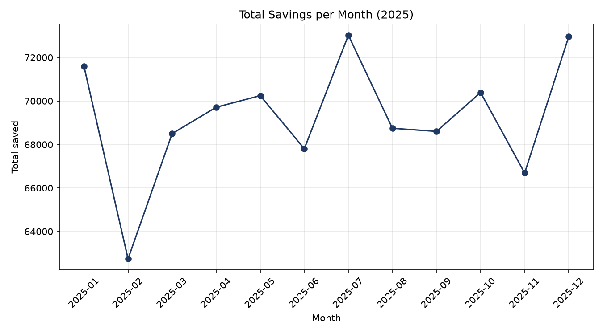
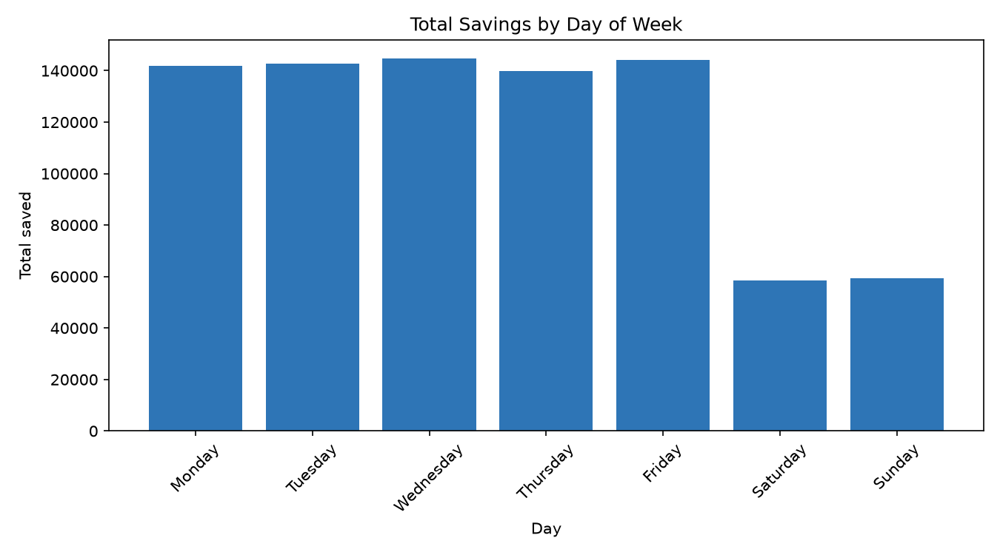
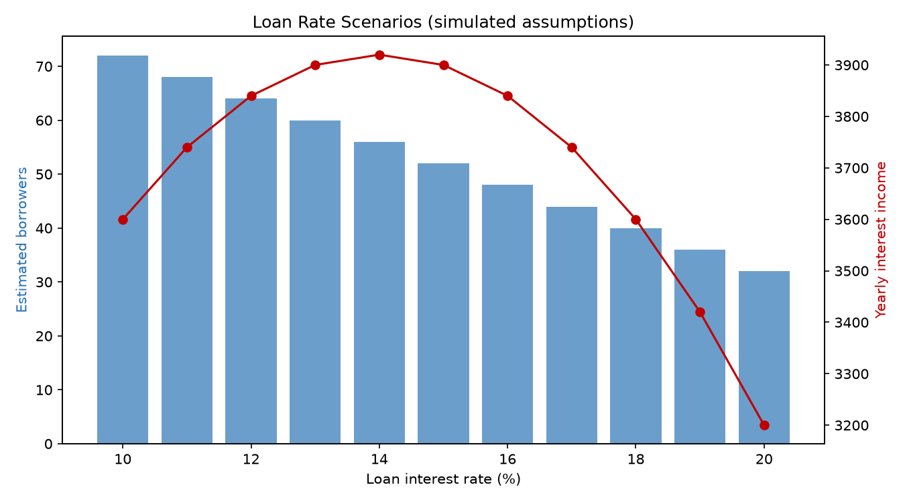

# Savings & Loan Rate Analyzer

A Python project that analyzes monthly savings trends for a small community savings group and explores how different loan interest rates could affect borrowing.

I built this to practice data analysis with pandas. It is inspired by my experience as a statistics analyst, where I used Excel and Python to analyze savings data collected from market women.

> **Note:** All data in this project is **simulated**. No real member information is used. The loan scenario results depend on made-up assumptions, so they illustrate how a model works rather than predict real outcomes.

## What it does

1. **Generates sample data:** 200 fake members making daily deposits over one year, with more saving on weekdays than weekends.
2. **Summarizes savings by month:** total saved, average deposit, number of deposits, active members, and month-over-month growth.
3. **Creates charts:** monthly savings trends and savings by day of week.
4. **Models loan rate scenarios:** estimates borrowers and yearly interest income at rates from 10% to 20%.
5. **Exports an Excel report** with formatted tables and charts.

## Tools used

Python, pandas, NumPy, matplotlib, openpyxl, Excel

## Project structure

| File | Purpose |
|---|---|
| `generate_data.py` | Creates the simulated savings data (`savings_data.csv`) |
| `analyze_savings.py` | Calculates monthly and weekday summaries with pandas |
| `make_charts.py` | Builds charts with matplotlib |
| `loan_scenarios.py` | Runs the loan interest rate scenarios |
| `excel_report.py` | Combines everything into `savings_report.xlsx` |

## How to run it

Install the libraries:

```
pip install pandas numpy matplotlib openpyxl
```

Then run the scripts in order:

```
python3 generate_data.py
python3 analyze_savings.py
python3 make_charts.py
python3 loan_scenarios.py
python3 excel_report.py
```

## Results

**Monthly savings**



February had the lowest total savings. The average deposit stayed about the same as other months, and all members stayed active. The drop came from fewer deposits in a shorter month.

**Savings by day of week**



Weekday savings are far higher than weekend savings, which comes from the rules I used to generate the data.

**Loan rate scenarios**



With the default assumptions (each 1-point rate cut brings 10% more borrowers), yearly interest income peaks at a 14% rate. When I lowered that assumption to 3%, the best rate moved to the top of the range, because borrowers were less sensitive to price. This shows how much a model's answer depends on its assumptions.

## What I learned

This project recreates, with simulated data, the savings analysis I did at a credit union using Excel and Python, which helped inform a decision to lower loan interest rates. It was my first time using pandas, and I learned that `groupby` works like an Excel pivot table in code. I also learned that a model's results depend heavily on its assumptions, so I labeled every one clearly.

## Next steps

- Add a simple dashboard
- Let users upload their own CSV file
- Test additional assumptions in the loan model

## Author

Daniella Afrakomah Amankwah
Computer Science major, Accounting minor, Livingstone College
[LinkedIn](https://www.linkedin.com/in/daniella-afrakomah-amankwah-a1608726b/)
